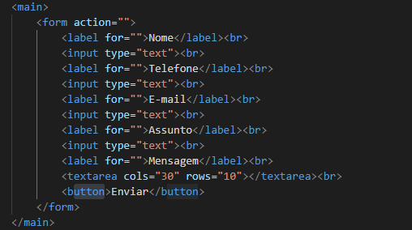
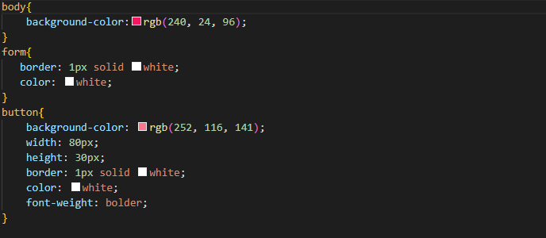
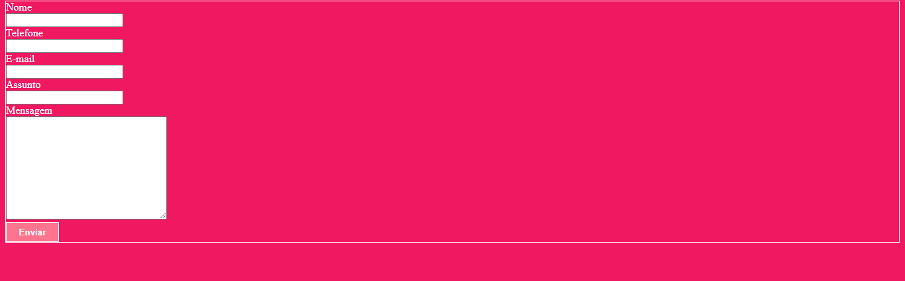

# form-contato     
## Índice
* [Descrição](#descrição)
* [Tecnologias](#tecnologias)
* [Referências](#referências)
* [Autor(a)](#autora)
 
### Descrição
O projeto consiste em uma tela de formulario básico, onde é possivel mandar uma mensagem de contato onde é
possivel adicionar o nome, telefone, e-mail, o tema da mensagem que sera encaminhada e o espaço para ser digitada a mensagem.
 
#### Tabela

* `main`-Entende-se como conteúdo principal aquele relacionado diretamente com o tópico central da página ou com a funcionalidade central da aplicação.
 
* `input`- Componente que permite a entrada de dados textuais por parte do usuário
 
* `textarea`- é um campo de entrada de texto que permite que seu aplicativo aceite um valor de texto potencialmente longo do usuário.
 
* `button`-representa um botão clicável.

Veja uma imagem de parte do codigo, onde é possivel indentificar o uso dos elementos mencionados a cima:

 
 
* `body` -  representa o conteúdo de um documento HTML. è permitido apenas um por documento.
 
* `background - color` - A propriedade CSS define a cor de fundo de um elemento, esta no seletores body e button

 
* `form` - Essa tag indica que estamos iniciando um formulário.
 
 * `border` - define a borda de um elemento.
 
 * `color` - O tipo de dado CSS indica uma cor no espaço sRGB, esta no seletores form e button.
 
 * `button` - Essa tag é usada para criar um botão de ação dentro de um formulário ou interface. Ela é usada quando queremos que o usuário execute uma ação específica, como enviar um formulário, confirmar uma ação ou executar um script.
 
 * `width` -  A propriedade CSS width determina a largura da área de conteúdo de um elemento. A área de conteúdo fica dentro do preenchimento, da borda, e da margem de um elemento.
 
 
 * `height` -  A propriedade CSS width determina a largura da área de conteúdo de um elemento. A área de conteúdo fica dentro do preenchimento, da borda, e da margem de um elemento.
 
* `font-weight`:especifica o peso ou a intensidade da fonte (ex.: negrito).

Veja uma imagem de parte do codigo, onde é possivel indentificar o uso dos elementos mencionado a cima:

### Resultado do projeto

 
## Tecnologias
* HTML5
* CSS3
* Git
* Github
 
## Referências
 [Alura](
https://www.alura.com.br/artigos/escrever-bom-readme
) - Como escrever um README incrivel no seu gitHub  
 
## Autor(a)
`O projeto foi desenvolvido por:`

* Yasmim Faria

 